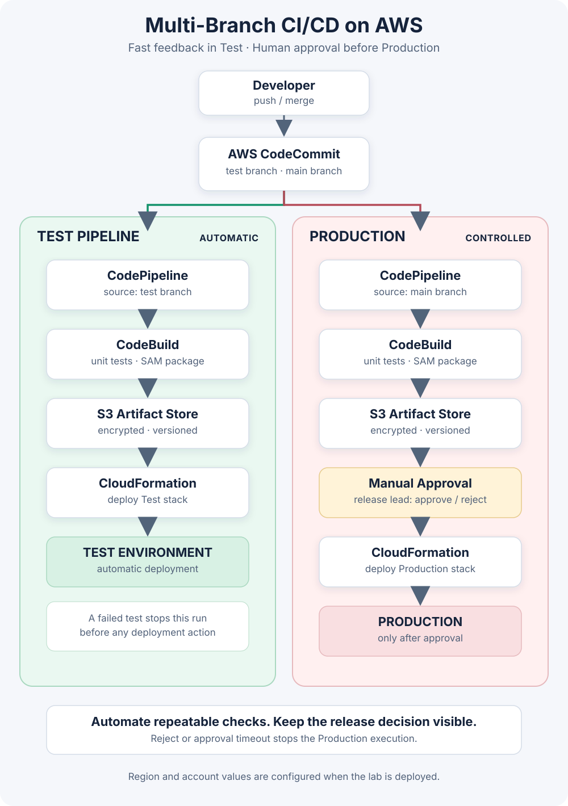

# AWS Multi-Branch CI/CD Lab

A small reference implementation of two isolated AWS CodePipeline releases:

- `test` runs unit tests, packages a SAM application, and deploys automatically to a test stack.
- `main` runs the same checks and packaging, pauses for a manual approval, then deploys the exact packaged revision to a production stack.

The idea is to keep fast feedback in Test while making a person explicitly own the Production release decision.



## Repository layout

```text
app/                  Lambda handler
tests/                Node.js unit tests
template.yaml         AWS SAM application stack
buildspec.yml         Test and package steps used by CodeBuild
infra/pipelines.yaml  Two-pipeline reference stack
images/               Architecture diagram
```

## How the flow works

1. A push to `test` or `main` starts only that branch's pipeline.
2. CodeBuild installs dependencies, runs `node --test`, and packages `template.yaml` with `aws cloudformation package`.
3. The packaged template and Lambda artifact are stored in the encrypted, versioned pipeline artifact bucket.
4. The Test pipeline applies the package to its own CloudFormation stack immediately.
5. The Production pipeline waits at Manual Approval. Approving resumes CloudFormation deployment; rejecting or leaving the approval unanswered stops that execution.

Both branches build the revision they receive. Promotion should happen by merging tested code into `main`; the build is repeated for that commit, and the artifact produced by the Production pipeline is the one gated and deployed. For a stronger “promote the exact same artifact” guarantee, use a single pipeline with a cross-account/environment promotion stage and immutable artifact reference.

## Local checks

Requires Node.js 20+ and AWS SAM CLI for local packaging. Unit tests have no third-party dependencies.

```bash
npm test
sam validate --lint
```

The CodeBuild buildspec packages the application after tests pass. CodeBuild needs access to the artifact bucket supplied as `PACKAGE_BUCKET`.

## AWS lab setup

1. Create a CodeCommit repository with `test` and `main` branches, then push this project.
2. Deploy `infra/pipelines.yaml` in `ap-southeast-2` (or another supported region), setting the repository name and branch names.
3. Subscribe the release lead to the pipeline approval SNS topic and confirm the subscription.
4. Push to `test` and confirm tests and the Test CloudFormation stack complete.
5. Merge a tested change to `main`; inspect the build and approve or reject the Production action in CodePipeline.
6. Remove the lab stack when finished. Review CodeBuild minutes, S3 retention, CloudFormation resources, and account budgets first.

The pipeline stack is a teaching reference, not a turnkey production foundation. Review IAM policies, account separation, artifact retention, rollback strategy, change sets, alarms, and approval ownership before adapting it to real workloads. Never commit credentials or place secrets in buildspec files.

## Safety boundaries

- A failed unit test prevents packaging and deployment.
- Production has a distinct pipeline and stack, with a manual approval stage immediately before deployment.
- The approval is a release control, not proof that the change is safe; reviewers still need test evidence and an operational rollback plan.
- The pipeline template is intentionally explicit and should be reviewed before deployment. Creating its AWS resources can incur charges.

## License

This lab is published for learning and portfolio demonstration. Check the repository owner’s preferred license before reusing it.
